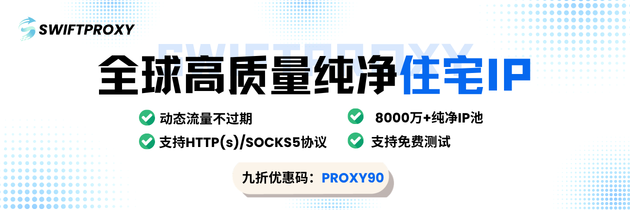

# AWS Builder ID 自动注册工具

[](https://www.python.org/)
[](LICENSE)
[](https://www.selenium.dev/)
[]()

自动化注册 AWS Builder ID 账号的工具，支持多地区环境模拟、浏览器指纹随机化和代理集成。

## 赞助商

[](https://www.swiftproxy.net/?ref=awsbuilderid)

[Swiftproxy](https://www.swiftproxy.net/?ref=awsbuilderid) — 8000万+高质量住宅 IP 覆盖 190+ 国家，连接稳定高匿名，支持自动化、数据采集与云业务场景，动态流量不过期，支持免费测试。九折优惠码：`PROXY90`

<a href="https://www.thordata.com/?ls=add&lk=add"></a>

[Thordata Proxy](https://www.thordata.com/?ls=add&lk=add) — 提供 190+ 地区一亿+真实 IP，注册即可领取 500MB 试用，支持动态与粘性会话、无限并发，包含动态住宅、静态 ISP、移动代理和无限量住宅代理，$0.65/GB 起，适合广告投放、数据采集、跨境电商、社媒矩阵等全球自动化业务。

## 什么是 AWS Builder ID

AWS Builder ID 是亚马逊提供的免费开发者账号，可用于访问 Amazon Q、CodeWhisperer、Kiro 等 AI 编程工具，无需绑定信用卡。

## 功能特性

| 功能 | 说明 |
|-----|------|
| 多地区支持 | 美国、德国、日本三个地区的语言和时区环境 |
| 设备模拟 | 桌面浏览器和移动设备 User-Agent 切换 |
| 指纹随机化 | CPU 核心数、内存、WebGL 等硬件指纹伪装 |
| 代理支持 | 静态代理和动态代理 API 两种模式 |
| 邮箱验证 | 临时邮箱自动接收验证码，支持 Outlook IMAP |
| 反检测 | 基于 undetected-chromedriver，绕过自动化检测 |

## 工作原理

1. 创建临时邮箱地址
2. 启动反检测浏览器，模拟目标地区环境
3. 自动填写注册表单
4. 从临时邮箱获取验证码并完成验证
5. 保存账号信息到本地文件

## 前置要求

- Python 3.10 或更高版本
- Chrome 浏览器（会自动下载对应版本的 ChromeDriver）
- 临时邮箱服务（见下方配置说明）
- （可选）代理服务，用于 IP 隔离

## 快速开始

### 1. 克隆项目

```bash
git clone https://github.com/7836246/aws-builder-id.git
cd aws-builder-id
```

### 2. 安装依赖

```bash
pip install -r requirements.txt
```

### 3. 部署临时邮箱服务

本项目依赖临时邮箱接收 AWS 发送的验证码。推荐使用 [cloudflare_temp_email](https://github.com/dreamhunter2333/cloudflare_temp_email)：

**部署步骤：**

1. 准备一个域名，并将 DNS 托管到 Cloudflare
2. Fork [cloudflare_temp_email](https://github.com/dreamhunter2333/cloudflare_temp_email) 项目
3. 按照该项目文档部署到 Cloudflare Workers
4. 在 Cloudflare 控制台配置 Email Routing，将邮件转发到 Worker
5. 记录你的 Worker URL（如 `https://xxx.workers.dev`）和域名

### 4. 修改配置

编辑 `config/config.yaml`：

```yaml
# 邮箱服务配置（必填）
email:
  worker_url: "https://your-worker.workers.dev"  # 你的 Worker 地址
  domain: "your-domain.com"                       # 你的收信域名
  wait_timeout: 120                               # 等待验证码超时时间（秒）

# 地区配置
region:
  current: "usa"           # 可选: usa / germany / japan
  device_type: "desktop"   # 可选: desktop / mobile

# 代理配置（可选，但推荐使用）
  use_proxy: false         # 是否启用代理
  proxy_mode: "static"     # static: 固定代理 / dynamic: 动态API
  proxy_url: ""            # 静态代理地址，如 http://127.0.0.1:7890
```

### 5. 运行

```bash
# Windows 用户
run.bat

# 或直接运行
python src/runners/main.py
```

### 6. 查看结果

注册成功的账号保存在 `accounts.jsonl` 文件中：

```json
{
  "email": "xxx@your-domain.com",
  "password": "自动生成的密码",
  "name": "随机姓名",
  "created_at": "2025-01-13 10:00:00",
  "status": "registered"
}
```

## 项目结构

```
├── config/
│   ├── config.yaml       # 主配置文件
│   └── languages.yaml    # 多语言文本配置
├── docs/                  # 详细文档
├── scripts/               # 辅助脚本（切换地区、测试代理等）
└── src/
    ├── runners/           # 运行入口
    │   ├── main.py        # 单次运行
    │   ├── batch_run.py   # 批量运行
    │   └── smart_run.py   # 智能运行（自动检测地区）
    ├── services/          # 邮箱服务
    ├── managers/          # 代理管理
    └── helpers/           # 工具函数
```

## 辅助脚本

```bash
# 切换地区
python scripts/switch_region.py usa
python scripts/switch_region.py germany
python scripts/switch_region.py japan

# 切换设备类型
python scripts/switch_device.py mobile
python scripts/switch_device.py desktop

# 测试代理连接
python scripts/check_proxy.py

# 检查浏览器指纹
python scripts/check_fingerprint.py
```

## 详细文档

- [完整使用说明](docs/USAGE.md) - 详细配置和使用指南
- [代理配置指南](docs/PROXY_GUIDE.md) - 静态代理和动态代理 API 配置
- [指纹伪装说明](docs/FINGERPRINT_GUIDE.md) - 浏览器指纹随机化原理
- [移动设备模拟](docs/MOBILE_GUIDE.md) - 移动端 User-Agent 配置
- [地区配置说明](docs/README_REGION.md) - 多地区环境隔离

## 常见问题

**Q: 验证码收不到怎么办？**

检查临时邮箱服务是否正常，确认 Cloudflare Email Routing 配置正确。可以先手动发送测试邮件验证。

**Q: 被检测为机器人怎么办？**

1. 启用代理，使用目标地区的 IP
2. 尝试切换到移动设备模式
3. 更换地区配置

**Q: 代理连接失败？**

运行 `python scripts/check_proxy.py` 测试代理是否可用。

## 相关项目

- [cloudflare_temp_email](https://github.com/dreamhunter2333/cloudflare_temp_email) - 基于 Cloudflare 的临时邮箱服务

## 免责声明

本项目仅供学习和研究自动化技术使用。使用者需自行承担使用风险，请遵守 AWS 服务条款和相关法律法规。作者不对任何滥用行为负责。

## 许可证

[MIT License](LICENSE)
